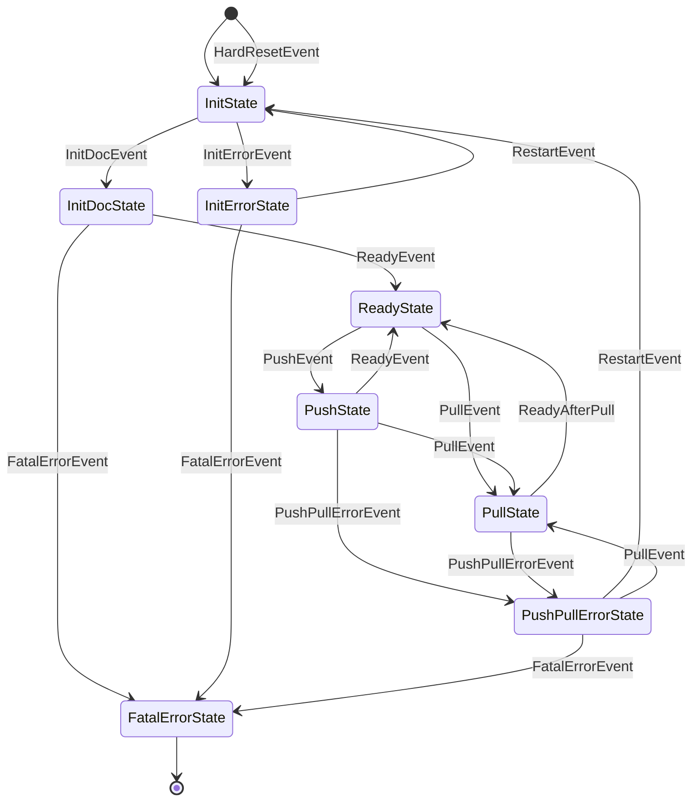

Docs coming soon

### Installation

```
{{npmInstallation "@bangle.dev/collab-client"}}
```


### State chart



```mermaid
stateDiagram-v2
    [*] --> InitState
    [*] --> InitState: HardResetEvent
    InitState --> InitDocState: InitDocEvent
    InitState --> InitErrorState: InitErrorEvent
    InitDocState --> ReadyState: ReadyEvent
    InitDocState --> FatalErrorState: FatalErrorEvent
    InitErrorState --> InitState: RestartEvent
    InitErrorState --> FatalErrorState: FatalErrorEvent
    ReadyState --> PushState: PushEvent
    ReadyState --> PullState: PullEvent
    PushState --> ReadyState: ReadyEvent
    PushState --> PullState: PullEvent
    PushState --> PushPullErrorState: PushPullErrorEvent
    PullState --> ReadyState: ReadyAfterPull
    PullState --> PushPullErrorState: PushPullErrorEvent
    PushPullErrorState --> InitState: RestartEvent
    PushPullErrorState --> PullState: PullEvent
    PushPullErrorState --> FatalErrorState: FatalErrorEvent
    FatalErrorState --> [*]
```